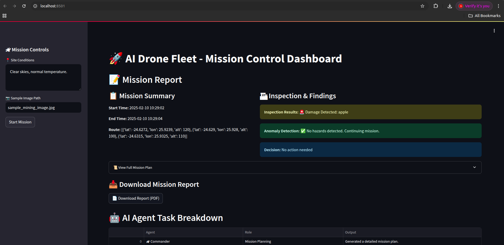
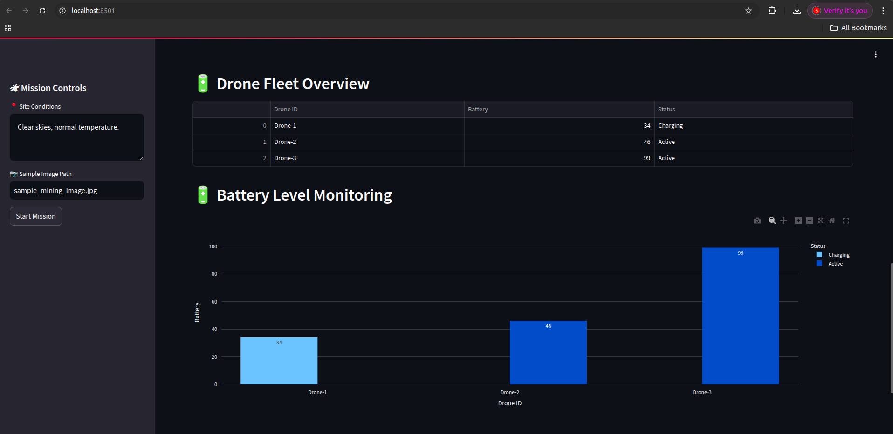
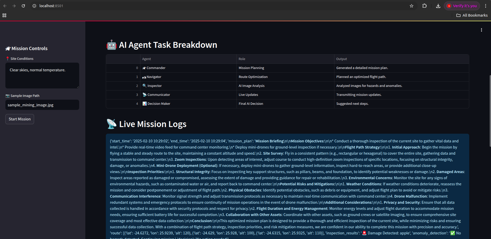
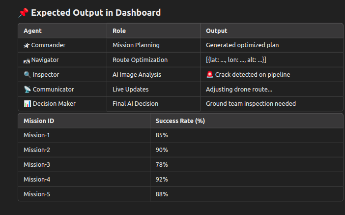

# 🚀 AI Drone Fleet Management System

## 📌 Overview
The **AI Drone Fleet Management System** is an **autonomous AI-powered drone control application** that utilizes **multi-agent AI architectures** to plan, analyze, and optimize drone missions for **various industrial applications**.

Using **LLM-powered AI Agents**, this system **plans optimal routes, detects anomalies in real-time, makes autonomous decisions, and generates mission reports**—eliminating the need for manual drone control.

### 🔥 **Key Capabilities**
✔ **Autonomous Drone Mission Planning** 🛰  
✔ **Real-time AI-powered Anomaly Detection** 🔍  
✔ **LLM-powered Decision Making** 🤖  
✔ **Optimized Flight Path Strategy** 🛣  
✔ **Automated Report Generation (PDF)** 📜  
✔ **Live Drone Fleet Monitoring (3D Visualization)** 🗺  

---

## 🌍 **Problem Statement**
Traditional drone operations require **manual control** and **human intervention** for decision-making. This leads to:
- Inefficient **route planning** 🚀  
- **Delayed responses** to hazards 🛑  
- **Data overload** without intelligent filtering 📊  
- Lack of **automated anomaly detection** 🚨  

### ✅ **Solution**
This system enables **AI-powered multi-agent automation**, allowing drones to:
✔ Plan optimal flight paths 📍  
✔ Perform real-time **image inspections** 🖼  
✔ **Detect and respond** to hazards **autonomously** 🚨  
✔ Generate **detailed mission reports** 📜  

---

## 🔧 **Tech Stack**
This project utilizes **cutting-edge AI, machine learning, and NLP-based agents**.

| **Technology** | **Purpose** |
|---------------|------------|
| **Python 3.11** | Core programming language. |
| **LangChain** | LLM-based AI reasoning & response generation. |
| **LangGraph** | Multi-agent workflow orchestration. |
| **CrewAI** | AI agents working in teams for mission tasks. |
| **FAISS** (Facebook AI Similarity Search) | **Vector database** for mission retrieval. |
| **OpenAI/Groq LLMs** | AI decision-making via large language models. |
| **YOLOv8 (Ultralytics)** | AI-powered **real-time image detection**. |
| **PyTorch** | Deep learning framework for model execution. |
| **Streamlit** | **Interactive web-based UI** for mission control. |
| **MongoDB** | Storing mission logs and reports. |
| **NGINX** | Proxy for deployment. |

---

## 🤖 **AI Agents Used (LangChain, CrewAI, LangGraph)**
This system uses a **multi-agent AI architecture**, where **each AI Agent performs a specific role**.

### **1️⃣ AI Commander Agent**
- **Technology**: LangChain + Groq/OpenAI LLM  
- **Role**: **Generates a strategic mission plan** based on site conditions.  
- **How It Works**:  
  - Accepts **environmental data** (wind, terrain, temperature).  
  - Uses **LLMs (GPT-4, LLaMA-3, or Mistral)** to generate an **optimized flight path strategy**.  
  - Outputs a **mission briefing** (route plan, risk assessment, objectives).  

---

### **2️⃣ AI Navigator Agent**
- **Technology**: LangGraph + FAISS  
- **Role**: **Optimizes and adjusts drone flight paths** dynamically.  
- **How It Works**:  
  - Retrieves past **missions** using **FAISS vector database**.  
  - Adapts **waypoints** using **LangGraph’s AI-driven task graph**.  
  - Updates the **drone's route in real-time** in response to obstacles.  

---

### **3️⃣ AI Inspector Agent**
- **Technology**: Ultralytics YOLOv8 + PyTorch  
- **Role**: **Analyzes drone-captured images for defects or hazards**.  
- **How It Works**:  
  - Runs **YOLOv8 model** to detect cracks, leaks, debris, or unauthorized activity.  
  - **Outputs a structured anomaly report**.  
  - Uses **image embeddings** stored in **FAISS** for future retrieval.  

---

### **4️⃣ AI Decision Maker Agent**
- **Technology**: CrewAI + LLMs (Groq, GPT-4)  
- **Role**: **Evaluates inspection results and suggests the next actions**.  
- **How It Works**:  
  - Takes **YOLO results + navigation data** as input.  
  - Uses an **LLM** to **decide whether to reroute, alert human operators, or continue mission**.  
  - Outputs a **structured decision response**.  

---

### **5️⃣ AI Communicator Agent**
- **Technology**: LangChain + MongoDB  
- **Role**: **Transmits mission logs and live alerts**.  
- **How It Works**:  
  - Stores **all mission events** in a structured **MongoDB database**.  
  - **Pushes updates** via the **Streamlit web UI**.  

---

## 📌 **Application Workflow (Step-by-Step)**
### **🛰 Step 1: Start the Drone Mission**
- Enter **site conditions** in the **Streamlit dashboard**.  
- Upload site **images** (mining area, construction site, etc.).  
- The **AI Commander** generates a **mission briefing**.

### **🛣 Step 2: AI Navigator Plans Route**
- **FAISS-powered retrieval** fetches **previous mission paths**.  
- The best **flight plan is dynamically adjusted**.  

### **🔍 Step 3: AI Inspector Analyzes Images**
- AI-powered **YOLOv8 model** detects **cracks, leaks, or obstacles**.  
- Drones send **real-time footage for analysis**.

### **📡 Step 4: Communicator Sends Updates**
- Live mission logs and **alerts** appear in the **dashboard**.  
- AI detects **low battery or environmental risks**.  

### **🤖 Step 5: Decision Maker AI Takes Action**
- AI **evaluates anomalies and makes decisions**:
  - **Reroute the drone**.
  - **Trigger emergency landing**.
  - **Alert human operators**.

### **📜 Step 6: Generate AI-Powered Mission Report**
- **Full mission report is auto-generated**.
- Includes **drone route, inspection results, success rate, and AI decisions**.
- **Downloadable as a PDF**.  

### **📊 Step 7: Visualization & Analytics**
- **Live drone status** table (battery, active/returning status).
- **Mission success rate trends**.
- **AI agent performance tracking**.

---

## ⚙️ **How to Run the Application**
### **1️⃣ Clone the Repository**
```bash
git clone https://github.com/sourabh2104/AI-Drone-Fleet
cd AI-Drone-Fleet


## 2️⃣ Install Dependencies
```bash
python3 -m venv m_drones
source m_drones/bin/activate
pip install -r requirements.txt
```

### 3️⃣ Set Up API Keys
Create .env and add:
```bash
GROQ_API_KEY=your_api_key_here
```
### 4️⃣ Run the Streamlit Application
```bash
streamlit run dashboard/dashboard.py
```
Open http://localhost:8501 in your browser.


###🏢 Future Enterprise-Scale Enhancements
✔ Connect with real drone hardware APIs (DJI, PX4, Ardupilot).
✔ Deploy on AWS/GCP for cloud-based mission storage.
✔ Integrate with IoT sensors for environmental data collection.
✔ Enable real-time 5G connectivity for enhanced mission tracking.
✔ Upgrade AI models using self-supervised learning (YOLOv9, SAM).

###🎯 Conclusion
The AI Drone Fleet Management System leverages LLMs, multi-agent AI, and advanced computer vision to revolutionize industrial drone operations.

💡 🚀 Ready to scale AI-powered drone operations? Let’s build the future!


### 📩 Contact & Contribution
👨‍💻 Developer: Sourabh
📧 Email:
sourabhyadav1256@gmail.com

### 🌍 GitHub:
https://github.com/sourabh2104


## 📸 Screenshots

### Mission Control


### 🛰 AI Drone Monitoring


### 🤖 AI Agent Task Breakdown


### 📊 Mission Success Rate Table


## 📸 Screenshots

### Mission Control


### 🛰 AI Drone Monitoring


### 🤖 AI Agent Task Breakdown


### 📊 Mission Success Rate Table


## 📸 Screenshots

### Mission Control


### 🛰 AI Drone Monitoring


### 🤖 AI Agent Task Breakdown


### 📊 Mission Success Rate Table


## 📸 Screenshots

### Mission Control


### 🛰 AI Drone Monitoring


### 🤖 AI Agent Task Breakdown


### 📊 Mission Success Rate Table

## 📸 Screenshots

### Mission Control


### 🛰 AI Drone Monitoring


### 🤖 AI Agent Task Breakdown


### 📊 Mission Success Rate Table

## 📸 Screenshots

### Mission Control


### 🛰 AI Drone Monitoring


### 🤖 AI Agent Task Breakdown


### 📊 Mission Success Rate Table


## 📸 Screenshots

### Mission Control


### 🛰 AI Drone Monitoring


### 🤖 AI Agent Task Breakdown


### 📊 Mission Success Rate Table


## 📸 Screenshots

### Mission Control


### 🛰 AI Drone Monitoring


### 🤖 AI Agent Task Breakdown


### 📊 Mission Success Rate Table

## 📸 Screenshots

### Mission Control


### 🛰 AI Drone Monitoring


### 🤖 AI Agent Task Breakdown


### 📊 Mission Success Rate Table

## 📸 Screenshots

### Mission Control


### 🛰 AI Drone Monitoring


### 🤖 AI Agent Task Breakdown


### 📊 Mission Success Rate Table


## 📸 Screenshots

### Mission Control


### 🛰 AI Drone Monitoring


### 🤖 AI Agent Task Breakdown


### 📊 Mission Success Rate Table


## 📸 Screenshots

### Mission Control


### 🛰 AI Drone Monitoring


### 🤖 AI Agent Task Breakdown


### 📊 Mission Success Rate Table


## 📸 Screenshots

### Mission Control


### 🛰 AI Drone Monitoring


### 🤖 AI Agent Task Breakdown


### 📊 Mission Success Rate Table

## 📸 Screenshots

### Mission Control


### 🛰 AI Drone Monitoring


### 🤖 AI Agent Task Breakdown


### 📊 Mission Success Rate Table

## 📸 Screenshots

### Mission Control


### 🛰 AI Drone Monitoring


### 🤖 AI Agent Task Breakdown


### 📊 Mission Success Rate Table


## 📸 Screenshots

### Mission Control


### 🛰 AI Drone Monitoring


### 🤖 AI Agent Task Breakdown


### 📊 Mission Success Rate Table


## 📸 Screenshots

### Mission Control


### 🛰 AI Drone Monitoring


### 🤖 AI Agent Task Breakdown


### 📊 Mission Success Rate Table


## 📸 Screenshots

### Mission Control


### 🛰 AI Drone Monitoring


### 🤖 AI Agent Task Breakdown


### 📊 Mission Success Rate Table

## 📸 Screenshots

### Mission Control


### 🛰 AI Drone Monitoring


### 🤖 AI Agent Task Breakdown


### 📊 Mission Success Rate Table

## 📸 Screenshots

### Mission Control


### 🛰 AI Drone Monitoring


### 🤖 AI Agent Task Breakdown


### 📊 Mission Success Rate Table


## 📸 Screenshots

### Mission Control


### 🛰 AI Drone Monitoring


### 🤖 AI Agent Task Breakdown


### 📊 Mission Success Rate Table

